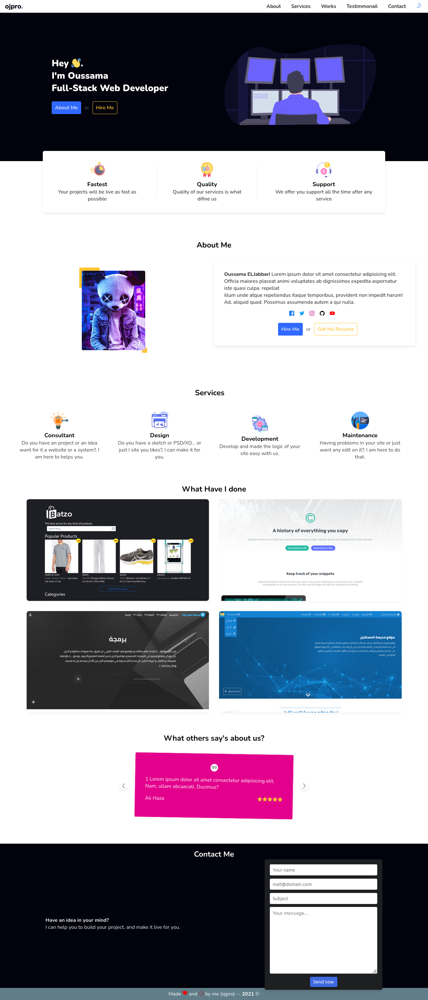
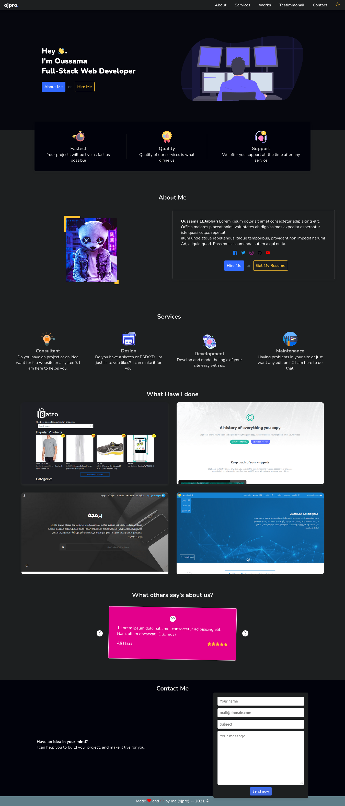
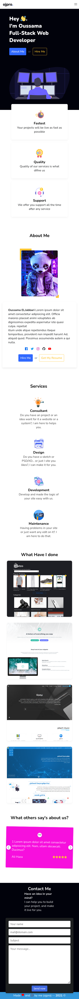
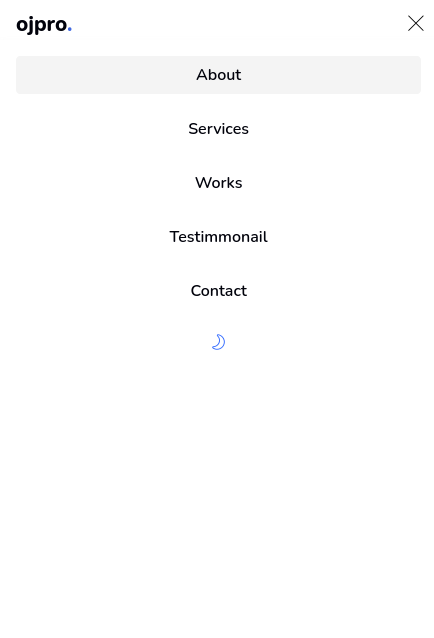
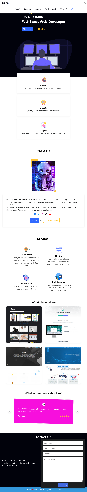

# ojpro - Portfolio
## Overview
That is the repository for my portfolio, where I share all of my work, freelance projects, challenges, and achievements.
> you can see it on [https://ojpro.me](https://ojpro.me) or go to [screenshots](#Screenshots)
### 💡 Wait a minute!. What do ojpro means?
Nice question!. Because you "know" that my name is Oussama El Jabbari and I Love Programming, I mixed those words to make this name where:
+ o => Oussama
+ j => Jabbari
+ pro => Programming

`Good, but where is the "EL"?`

Yeah, I forget it 😉, May I include it in the next version 🙃.

## How do I build it?

1. Thinking of the idea, setting the goals, write a simple MVP, and explain how it works.
2. Decide which technologies I would use and the pattern that I will follow.
3. Do some sketches
4. Then Design (using Figma)
5. Create the project's basic structure (Folders & files).
6. Initialize Github repository
7. Write all the HTML
8. Move to the basic's styles
9. Include all needed plugins and libraries
10. Include javascript files and write main.js
11. Improvements.

## Plugins that help me to build this project

- Normalize.css
- Animate.css
- Lineicons
- AOS (Animate On Scroll)

### Screenshots
Light Desktop version

Dark Desktop version

Phone version

Active Menu

Tablet version

